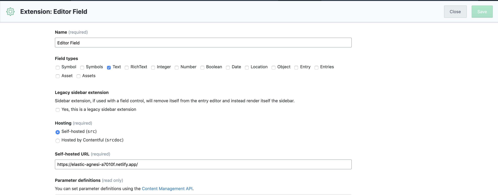

# Custom WYSIWYG Editor

Custom React WYSIWYG Editor based on [Slate.js](https://www.slatejs.org/) and [Material Design](https://material-ui.com/). Editor is used on nowaja-polsha's Contentful and is a replacement for Markdown editor.

## Goal

Nowaja-polsha's specific feature like adding footnote were hard to maintain in Markdown editor. The goal of the app is to maximally ease editors work. Although Contentful is a headless CMS, we decided to adapt in new editor styles of nowaja-polsha.

## Development

### Standalone

To run editor as standalone React app on your local machine:

1. Run local [parcel](https://parceljs.org/) server `yarn start`. The default PORT is 1234.

### Contentful

To test localhost version of app on Contentful:

1. Login to Contentful `yarn run cms:login`.
2. Choose space and environment `yarn run cms:configure`. **Do not use master environment!**
3. To not ovevrride existing extension, change field name in `extension.json` file. 
4. Host extension on your local machine to chosen space and environment `yarn run cms:start`.
5. Extension should be visible on Settings -> Extensions.
6. Go to Content Model -> create new Content Type or chose one of exisiting Conten Type -> click Add field and select same type as in `extension.json` file. 
7. After new field is added, set it apperance - click on Settings -> Apperance -> chose test version of editor field.
8. Go to entry and test localhost version of editor.

Hot reloading is enabled so you don't have to refresh entry page to see changes.

## Build

Some of the features are Contentful specific - i.e. opening full page mode or chosing images from Contentful. These features are enabled when environment variable `IS_CONTENTFUL` is set to `true`.

### Standalone

Build app without contentful specific logic.

`yarn run build`

### Contentful

Build Contentful-ready app.

`yarn run cms:build`

## Deployment

Bundled app is too big to host in on Contentful, hence new space on Netlify was created.

1. Build app `yarn run cms:build`.
2. Go to [Netlify nowaja-contentful-editor page](https://app.netlify.com/sites/nowaja-contentful-editor/deploys) logged in on `gajos@cprdip.pl` account.
3. Drag & drop `build` folder.
4. If app was not previously added to Contentful go to `Settings -> Extensions` and click on `Add extension -> Add a new extension` button.

**Pleas note** that Contentful-ready editor requires Contentful's sdk.

